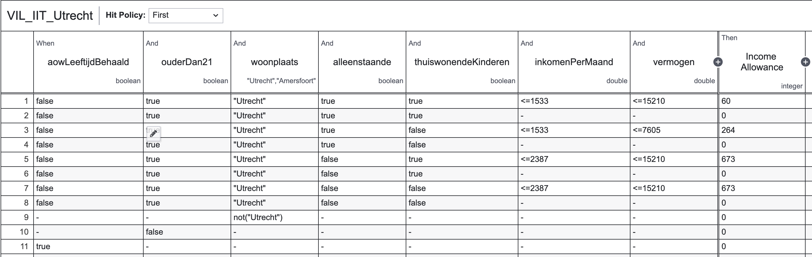

# Regels

Het idee achter regelbeheer is dat willekeur wordt tegengegaan in het beoordelen van aanvragen van burgers voor publieke dienstverlening. Goed regelbeheer geeft transparantie in de besluitvorming en de algoritmen die daarin worden gebruikt. Daarbij sluiten we aan bij technische standaarden zoals [DMN](https://en.wikipedia.org/wiki/Decision_Model_and_Notation), maar ook bij het bredere concept van [open regels](https://regels.overheid.nl/), zoals dat nu door ICTU in opdracht van BZK in gang is gezet met het oog op vertaling van wetten naar praktisch uitvoerbare regelingen in het sociaal domein en uiteindelijk naar alle publieke dienstverlening.

## DMN-tabellen

Als je gaat innoveren in het sociaal domein met het concept van burgerregie, dan merk je dat er verschillende interpretaties bestaan in het beoordelen van aanvragen door gemeenten. Vaak kan dat niet anders vanwege incomplete of niet actuele gegevens, uitzonderingen of complexe gevallen waarbij meerdere wetten van toepassing zijn. We willen daarom de focus leggen op 80% van de aanvragen waarbij we er wel vanuit kunnen gaan dat die eenduidig zijn te beoordelen aan de hand van actuele gegevens.

Zodra gegevens actueel en van een betrouwbare bron afkomstig zijn, zodat gecontroleerd kan worden volgens de SSI-methodiek, kunnen die gevoed worden aan een regeling die op basis van de voorwaarden (regels in een DMN-tabel) een uitslag geeft of men al of niet daaraan voldoet. Dat geeft een aantal voordelen:

* een regeling kan geautomatiseerd worden waarmee de doorlooptijd sterk wordt verkort
* de voorwaarden zijn transparant en de uitslag op basis van de gevoede gegevens daarmee ook
* er is voor beide partijen (burger en dienstverlener) een controleerbare audittrail
* de check op een regeling kan (anoniem) door een burger zelf worden gedaan
* latent niet-gebruik wordt tegengaan, alsmede kansloze aanvragen aangezien al van tevoren voor een burger duidelijk wordt of hij er mogeljk voor in aanmerking komt

In technische zin gebruiken we dus voor de regelingen DMN-tabellen, waarbij de voorwaarden/regels ook voor een niet-technisch geschoold persoon goed te refereren zijn aan de wettelijke voorwaarden. Hier een voorbeeld van de IIT (Inkomensafhankelijke toeslag) regeling:

## Services

| component (CI)                                                   | API                                                                   | Invoer                                           | Uitvoer                                           | Doel                                                        |
| ---------------------------------------------------------------- | --------------------------------------------------------------------- | ------------------------------------------------ | ------------------------------------------------- | ----------------------------------------------------------- |
| [Inkomensverrekening](https://gitlab.com/ovrhd/igs/regelservice)    | [https://regelservice.fnctn.nl/docs](https://regelservice.fnctn.nl/docs) | loonwaarden en parameters                        | uit te betalen bedrag op basis van loon           | het verrekenmodel voor aanvullende inkomsten naast bijstand |
| [Diagnose service](https://gitlab.com/ovrhd/igs/regelservice)       | [https://regelservice.fnctn.nl/docs](https://regelservice.fnctn.nl/docs) | een configureerbare set aan vragen               | een score op basis van antwoorden en weegfactoren | hulpmiddel voor snelle triage gebaseerd op DMN-modellen     |
| [Regel service algemeen](https://gitlab.com/ovrhd/igs/regelservice) | [https://regelservice.fnctn.nl/docs](https://regelservice.fnctn.nl/docs) | een configureerbare set aan regels of parameters | een DMN model                                     | besluitvorming transparant maken                            |

## Achtergrond actuele gegevens

Actualiteit van gegevens is een belangrijk onderwerp gebleken in de looptijd van de TWI en IGS programma's.

### Inkomensvolatiliteit

Er is een visie nodig op inkomensvolatiliteit, zoals bij ZZP-ers met een fluctuerend inkomen en tijdelijke contracten. De loonaangifteketen eindigt met een brutoloon en enkele belastingcomponenenten, die niet voldoende zijn voor een correcte weergave van de inkomenspositie van de burger in het kader van de Participatiewet.

De data in SUWInet mag dan correct zijn in systeemtechnische zin, de uitvoering heeft er in zoverre iets aan dat het een momentopname betreft van mensen die in vaste dienst zijn of een uitkering hebben van UWV. De doelgroep van de Participatiewet (en van deze pilot) zit deels in de bijstand en heeft deels aanvullende inkomsten, dat betekent dat er andere gegevens nodig zijn om uitspraken te kunnen doen over de inkomenspositie. De data moet actueler, vollediger en uitgebreider zijn dan nu in de loonaangifte-keten wordt geregistreerd.

Daarbij zijn de nodige toeslagen gebaseerd op een jaarinkomen. Om dus te kunnen bepalen of aanvullend werk van invloed is op toeslagen, moet het maandinkomen elke keer worden geëxtrapoleerd, waarbij wellicht in de laatste maanden van het jaar pas duidelijk wordt of menover een bepaalde grens heen gaat met bijbehorende perverse prikkel om dan maar niet meer te gaan verdienen.

Bij ZZP-ers tegen de armoedegrens zou dan een beoordeling op basis van contractwaarde/of opdrachtenportefeuille moeten plaatsvinden en die maandelijks bijstellen. Je krijgt dan meer dynamiek in de uitvoering, waar de huidige processen niet op zijn toegerust.

### Werkvolatiliteit

Gegevensuitwisseling in het sociaal domein is nu vooral gericht op statische arbeids- en uitkeringsregelingen (inkomstenverhoudingen), terwijl de werkelijkheid inmiddels sterk dynamisch van karakter is. De [Commissie-Borstlap](https://www.rijksoverheid.nl/documenten/rapporten/2020/01/23/rapport-in-wat-voor-land-willen-wij-werken) heeft een aantal aanbevelingen gedaan, waaronder deze:

**Leven lang ontwikkelen**

* Iedereen krijgt bij geboorte een persoonlijk ontwikkelbudget;
* De werkgever stort maandelijks een bijdrage in dat budget;
* Bij ontslag wordt de transitievergoeding in het ontwikkelbudget gestort;
* Iedereen wordt verplicht tot een periodieke loopbaan APK;
* Een loopbaanwinkel die alle werkenden ondersteunt bij het gebruikmaken van het ontwikkelbudget.

**Activerend en inclusief arbeidsmarktbeleid**

* Voorkom (langdurige) uitval door tijdig switchen en publiek-private samenwerking
* Losgekoppeld van uitkering;
* Vanaf dag één in een gestructureerde setting werken aan verbetering van hun kansen op de arbeidsmarkt;
* Investeren in volwaardige participatie aan de basis van de arbeidsmarkt;

Dit betekent voor burgerregie dat iedereen in staat moet worden gesteld de regie op zijn loopbaan te houden en zijn CV actueel te houden wat betreft werk, tijdelijke opdrachten en tussentijdse opleidingen. Veel vaker dan nu zullen arbeidsmarktregelingen daarop gebaseerd zijn en in het sociaal domein betekent dat een herhaalde uitwisseling van actuele werk- en opleidingsgegevens, die door de burger zelf worden bijgehouden.
